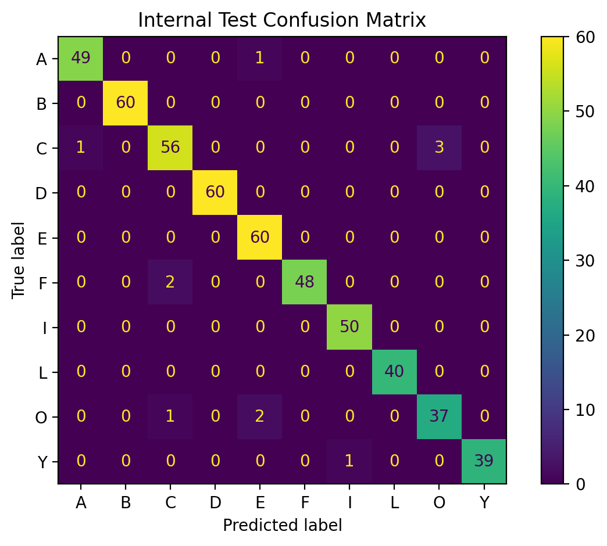
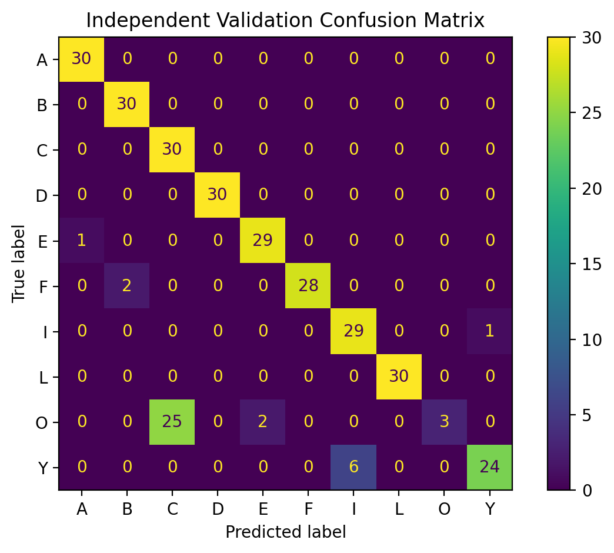

# ASL Hand Sign Recognition

A real-time hand sign recognition project that classifies 10 static American Sign Language (ASL) letters using MediaPipe hand landmarks and a Random Forest classifier.

The project currently recognizes:

**A, B, C, D, E, F, I, L, O, Y**

## Overview

The system captures hand landmarks from a webcam using MediaPipe and converts them into numerical features that are classified using a Random Forest model.

The project was built as a hands-on introduction to computer vision and machine learning, including:

- Data collection
- Landmark normalization
- Feature engineering
- Model training
- Independent validation
- Confusion matrix analysis
- Real-time prediction

## How It Works

The recognition pipeline is:

Camera  
→ MediaPipe Hand Detection  
→ 21 hand landmarks  
→ 63 normalized coordinates  
→ 11 additional geometric distance features  
→ 74 total features  
→ Random Forest classifier  
→ Predicted ASL letter

MediaPipe provides 21 landmarks for the detected hand.

Each landmark contains:

- X coordinate
- Y coordinate
- Z coordinate

This initially produces:

21 landmarks × 3 coordinates = **63 features**

The coordinates are normalized using the wrist as the origin and the wrist-to-middle-finger-base distance as a scale reference.

## Feature Engineering

The first version of the model used only the 63 normalized landmark coordinates.

A second version added 11 geometric features based on distances between important landmarks, including:

- Thumb to index fingertip
- Thumb to middle fingertip
- Thumb to ring fingertip
- Thumb to pinky fingertip
- Distances between neighboring fingertips
- Fingertip distances from the wrist

This increased the input from **63 to 74 features**.

## Model

The classifier uses:

**RandomForestClassifier**

with:

- 200 decision trees
- 80/20 training/test split
- Stratified class distribution
- Fixed random state for reproducibility

## Results

### Internal Test Set

The feature-engineered model achieved:

**97.84% accuracy**

on the 20% test split from the training dataset.

### Internal Test Confusion Matrix



### Independent Validation

To test generalization, I collected a separate dataset of 300 samples that was not used during model training.

| Model | Features | Validation Accuracy |
|---|---:|---:|
| Baseline | 63 | 77.00% |
| Feature-engineered model | 74 | 87.67% |

Adding geometric distance features improved independent validation accuracy by:

**+10.67 percentage points**

### Independent Validation Confusion Matrix



## Error Analysis

The independent validation set showed that most letters were classified reliably.

The main remaining confusion was:

- **O → C**
- Occasionally **Y → I**

This suggests that visually similar hand shapes remain the main limitation of the current model.

## Real-Time Recognition

The real-time recognition program:

1. Captures webcam frames.
2. Detects one hand using MediaPipe.
3. Extracts and normalizes landmarks.
4. Generates the additional geometric features.
5. Runs the trained Random Forest model.
6. Displays predictions above a confidence threshold.
7. Uses a short prediction history to reduce frame-to-frame instability.

## Project Structure

```text
asl-hand-recognition/
│
├── src/
│   ├── collect_data.py
│   ├── features.py
│   ├── train_model.py
│   ├── validate_model.py
│   └── recognize_asl.py
│
├── data/
│   ├── asl_data.csv
│   └── asl_validation.csv
│
├── model/
│   └── asl_random_forest.pkl
│
├── results/
│   ├── confusion_matrix_internal.png
│   └── confusion_matrix_validation.png
│
├── README.md
├── requirements.txt
└── .gitignore
```

## Installation

Install the required dependencies:

```bash
pip install -r requirements.txt
```

## Run the Real-Time Classifier

From the project root:

```bash
python3 src/recognize_asl.py
```

Press **ESC** to close the webcam window.

## Train the Model

To train the Random Forest classifier:

```bash
python3 src/train_model.py
```

## Validate the Model

To evaluate the model using the independent validation dataset:

```bash
python3 src/validate_model.py
```

## Limitations

- Currently recognizes 10 static ASL letters.
- **O** can sometimes be confused with **C**.
- **Y** can occasionally be confused with **I**.
- Recognition can vary with hand orientation and capture conditions.
- The current system detects one hand at a time.
- Dynamic ASL letters such as **J** and **Z** are not currently supported.

## Future Improvements

- Expand recognition to more ASL letters.
- Support dynamic gestures such as J and Z.
- Collect training data from multiple users.
- Improve recognition of visually similar signs.
- Improve robustness to changes in lighting and hand orientation.
- Compare Random Forest with other machine learning models.

## What I Learned

This project helped me practice:

- Computer vision with MediaPipe and OpenCV
- Data preprocessing and normalization
- Feature engineering
- Supervised machine learning
- Model 